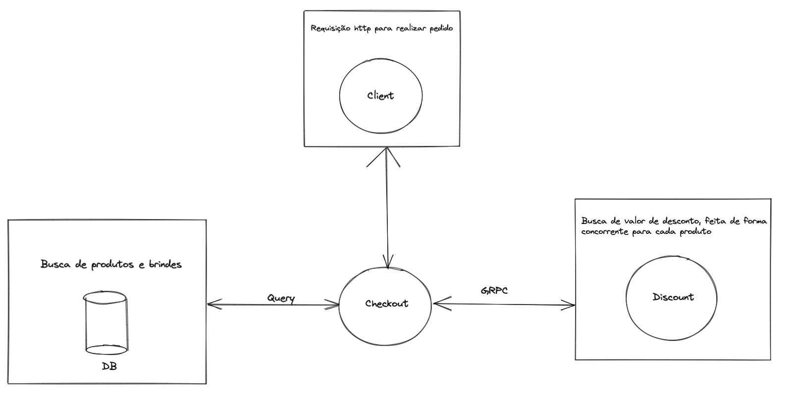

[](https://github.com/guil95/grpcApi/actions/workflows/go.yml)
# Fluxo


# Estruturação do projeto
    └─── api (Configuração do server)
    └─── config (Variáveis de ambiente)
    └─── core (Domínios da aplicação)
         └───checkout(Agregado de checkout)
            └───domain(Domínios que compõe o agregado checkout)
            └───infra(Implementações das camadas externas do agregado)
            └───use_cases(Casos de uso das regras de negócio do agregado)
         └───discount(Client grpc do agregado discount)
    └─── docs (Desenho do fluxo da aplicação)
    └─── pkg (Conexões externas)
        └─── db (Arquivo para banco de dados)
        └─── grpc (Conexão com o server grpc)
    └─── proto (Arquivo de contrato para client grpc)

# Como subir a aplicação

```shell
$ make start
```

# Rota
````shell
POST http://localhost:8000/checkout
````
### Exemplo de payload
```json
{
    "products": [
        {
            "id": 1,
            "quantity": 1
        },
	{
            "id": 2,
            "quantity": 1
        }
    ]
} 
```

### Exemplo de retorno
```json
{
  "total_amount": 108968,
  "total_amount_with_discount": 103521,
  "total_discount": 5447,
  "products": [
    {
      "id": 2,
      "quantity": 1,
      "unit_amount": 93811,
      "total_amount": 93811,
      "discount": 4690,
      "is_gift": false
    },
    {
      "id": 1,
      "quantity": 1,
      "unit_amount": 15157,
      "total_amount": 15157,
      "discount": 757,
      "is_gift": false
    }
  ]
}
```

# Execução de testes
```shell
$ make test
```

# Regra Black friday
Alterar a env `BLACK_FRIDAY_DATE` no arquivo .env para data que desejar no formato `Ano-mês-dia` e rodar `make start` 
para aplicar a alteração.
